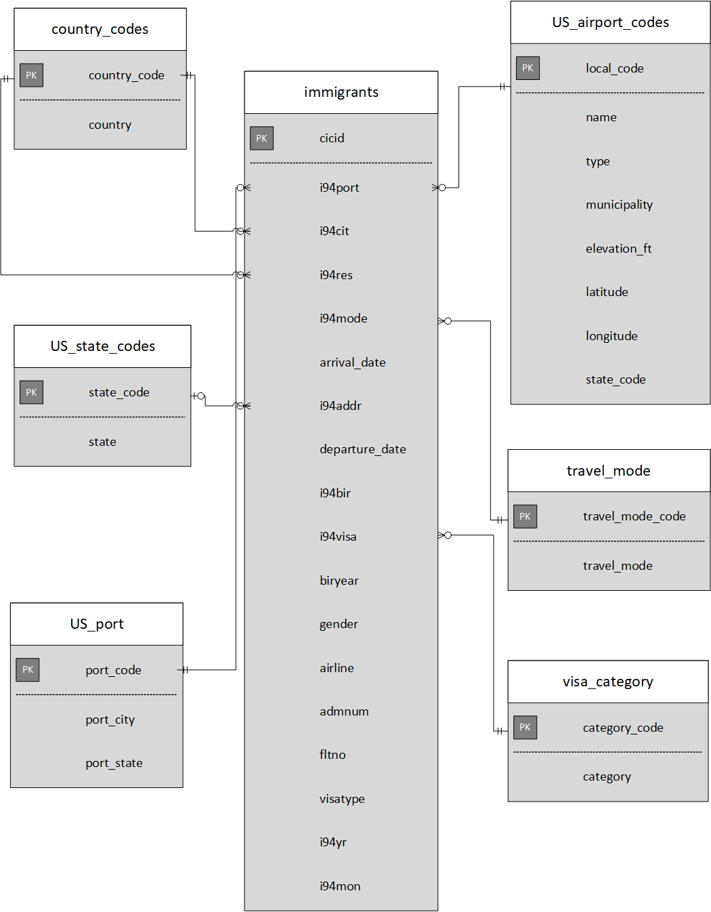
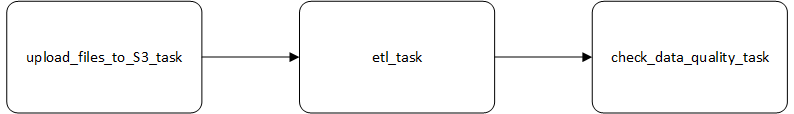

# Purpose:

To extract data from different sources in various formats (such as csv, sas files) and load the raw data in the data lake (AWS S3). Then, extract the raw data from S3, transform it and store it in S3 as parquet files. These parquet files can be pulled by data scientists, machine learning engineer, data analysts or business analysts for further analysis.

## Step 1: Gather data:

### Datasets:

1. **[I94 Immigration Data](https://www.trade.gov/national-travel-and-tourism-office)**: This data comes from the US National Tourism and Trade Office. I am using only April 2016 data for this project. This file contains more than 3 million records.
2. **[Airport Code Table](https://datahub.io/core/airport-codes#data)**: This is a simple table of airport codes and corresponding cities.
3. **I94_SAS_Labels_Descriptions.SAS**: Metadata

I created seven tables (country_codes, us_state_codes, us_port, us_airport_codes, travel_mode, visa_category and immigrants) as parquet files using transformed data that can be readily used for further analysis. The description of each table is provided in the **Data dictionary.xlsx** file.

## Step 2: Explore and Assess the data:

1. **i94_apr16_sub.sas7bdat**:
- Columns 'arrdate' and 'depdate' have number of days as values, which are converted to datetime using a function.
- The following columns datatype are converted to integer:
 - cicid, i94yr, i94mon, i94cit, i94res, i94bir, i94mode, i94visa, biryear, admnum

2. **airport-codes_csv.csv**:
- Retrieved the records that belongs to US only. I94 immigrations are done only in the US.
- Discarded closed airport and heliport. These ports are not used for immigration purpose.
- Dropped the duplicates of local_code by keeping only one record.
- Retrieved only the state code from the column 'iso_region'.
- Split the column 'coordinates' to 'latitude' and 'longitude'. The datatype of the columns 'latitude' and 'longitude' are converted to float.
- Column 'elevation_ft' datatype is converted to integer.

3. **I94_SAS_Labels_Descriptions.SAS**:
- Retrieved the metadata of the following:
 - Country codes from i94cntyl. Column 'country_code' is converted to integer.
 - US states from i94addrl.
 - Travel mode from i94model. Column 'travel_mode_code' is converted to integer.
 - Port from i94prtl. Retrieved only the US states after separating the city and state.

4. **Visa category**:
- Manually created the dictionary based on the metadata from **I94_SAS_Labels_Descriptions.SAS** file.
- Column 'category_code' is converted to integer.

## Step 3: Define the Data Model:

## Step 4: Run ETL to model the data:

### Prerequisites:

1. Create AWS account and access keys
2. Create S3 storage to store the raw data and transformed files
3. Create an EMR cluster

### Execution steps:

1. Run upload_files_to_s3 (**command**: `upload_files_to_s3.py`) script in the terminal. This scripts reads all the input files and then loads the raw data into S3 (Data lake).

2. Run etl (**command**: `python etl.py`) script in the terminal. This script reads the required files and loads data from S3, transforms the data, creates seven different tables, and writes them to parquet files in table directories on S3.

3. Run check_data_quality (**command**: `check_data_quality.py`) script in the terminal. This script checks whether all the tables have records and no null records and no duplicates in the primary key column.

### Clean up the resources:

1. Terminate EMR cluster
2. Delete S3 storage

## Step 5:

**What's the goal? Why did you choose the model?**

The goal of this process is to store the raw data in a storage, transform the data and load it as separate files or tables for analysis. In future, Data engineers can refer back the raw data whenever they encounter any corrupted files.

**What queries will you want to run?**

1. Query to show the top 10 countries from where people immigrated to US during Apr-2016
2. Query to show the count of people who came to US in each visa category during Apr-2016

These queries are available in **Queries.ipynb** file.

**How would Spark or Airflow be incorporated?**

**State the choice of Tools used.**

Tools used:
1. Amazon EMR cluster
2. Amazon S3
3. PySpark
4. SparkSQL
5. Pandas

Rationale for using the tools:

1. Amazon EMR Cluster (Spark):
   - Amazon EMR simplifies building and operating big data environments and applications. Related EMR features include easy provisioning, managed scaling, and reconfiguring of clusters, and EMR Studio for collaborative development.
   - Amazon EMR enables to quickly and easily provision as much capacity as needed, and automatically or manually add and remove capacity.
   - Amazon EMR is designed to reduce the cost of processing large amounts of data.
   - With Amazon EMR, multiple data stores can be leveraged, including Amazon S3, the Hadoop Distributed File System (HDFS), and Amazon DynamoDB.
   - Amazon EMR is the best place to run Apache Spark. It can be used to quickly and easily create managed Spark clusters from the AWS Management Console.

2. Amazon S3:
   - Amazon S3 is a highly durable, scalable, secure, fast, and inexpensive storage service.
   - Customers of all sizes and industries can store and protect any amount of data for virtually any use case, such as data lakes, cloud-native applications, and mobile apps.
   - With cost-effective storage classes and easy-to-use management features, it can optimize costs, organize data, and configure fine-tuned access controls to meet specific business, organizational, and compliance requirements.
   -  Data is stored as objects within resources called “buckets”, and a single object can be up to 5 terabytes in size.

3. PySpark
   - PySpark is the collaboration of Apache Spark and Python.
   - Apache Spark is an open-source, distributed processing system used for big data workloads. It utilizes in-memory caching, and optimized query execution for fast analytic queries against data of any size, whereas Python is a general-purpose, high-level programming language. It provides a wide range of libraries and is majorly used for Machine Learning and Real-Time Streaming Analytics.
   - In other words, it is a Python API for Spark that lets harness the simplicity of Python and the power of Apache Spark in order to tame Big Data.

4. Spark SQL
   - Spark SQL is a distributed query engine that provides low-latency, interactive queries up to 100x faster than MapReduce.
   - It includes a cost-based optimizer, columnar storage, and code generation for fast queries, while scaling to thousands of nodes.
   - Analysts can use standard SQL or the Hive Query Language for querying data

5. Pandas
   - Pandas is a fast, powerful, flexible and easy to use open source data analysis and manipulation tool, built on top of the Python programming language.

**Propose how often the data should be updated and why.**

1. country_codes, us_state_codes, us_port, us_airport_codes, travel_mode and visa_category can be updated monthly / quarterly. These data doesn't change often. It can also be done on adhoc basis whenever changes happen.
2. Immigrants file data has to be updated monthly.

**Include a description of how you would approach the problem differently under the following scenarios:**

**1. If the data was increased by 100x.**

If the data is increased by 100x
- AWS offers Elastic MapReduce (EMR), which provides the infrastructure to run Apache Hadoop on Amazon Web Services. The open-source Apache Hadoop has the ability to **expand horizontally** and can process structured as well as unstructured data.
- Hadoop reads data from AWS Amazon S3 and the split size depends on the version of AMI (Amazon Machine Image) being used. Hadoop splits the data on AWS Amazon S3 by triggering multiple HTTP range requests.

**2. If the pipelines were run on a daily basis by 7am.**

- CSV (airport codes) file takes around 40 minutes to process. Immigrations file for a month takes around 6 minutes. Metadata file takes around 1 minute. Airport codes and metadata file doesn't change often. For the first load, the entire process might take an hour. For the subsequent run, we can do incremental load on the immigrations file that doesn't take more than 5 minutes. By considering the total run time as well as not hindering the work during the work hours, I would prefer the pipelines to run at 4:00 am so that it will be completed before the start of work time. Pipelines (Apache Airflow) process can be set up to send email to the responsible person if there is any issue. Depending upon the issue, it can be resolved before the start of working hours.

**3. If the database needed to be accessed by 100+ people.**

- Managed scaling in EMR - automatically increase or decrease the number of instances or units in the cluster based on workload. EMR continuously evaluates cluster metrics to make scaling decisions that optimize the clusters for cost and speed. 

- Amazon Redshift has a maximum of 500 connections that can be created using the query editor.

## References:
https://cloud.netapp.com/blog/optimizing-aws-emr-best-practices
https://docs.aws.amazon.com/emr/latest/ManagementGuide/emr-managed-scaling.html
https://docs.aws.amazon.com/emr/latest/ManagementGuide/emr-automatic-scaling.html
https://www.edureka.co/community/49245/difference-between-working-of-auto-scaling-and-elb
https://knowledge.udacity.com/?nanodegree=nd027&page=1&project=577&rubric=2497
https://aws.amazon.com/big-data/what-is-spark/
https://aws.amazon.com/emr/features/spark/
https://docs.aws.amazon.com/redshift/latest/mgmt/amazon-redshift-limits.html
